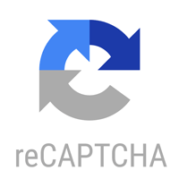
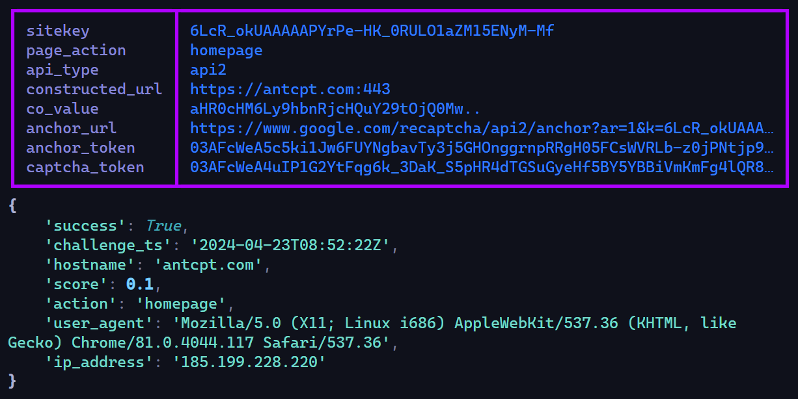
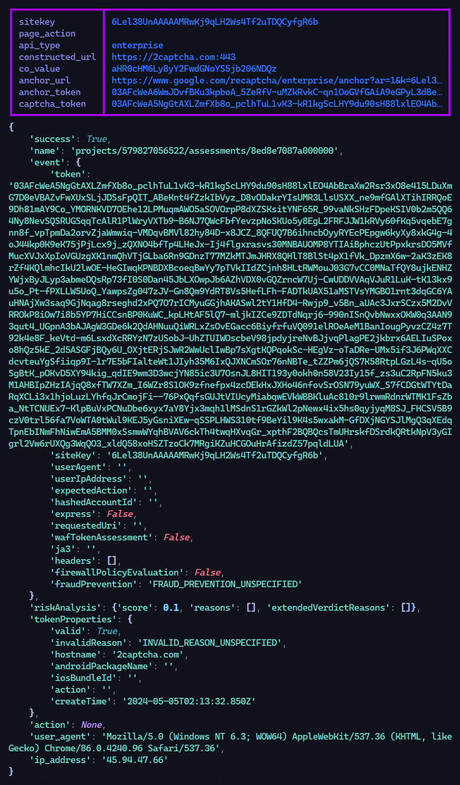

<div align="center">



**Recaptcha-V3** is a bypasser Google Recaptcha V3 with URL.

</div>

## **Installation**

**Using** `poetry`

```
git clone https://github.com/x404xx/Recaptcha-V3.git
cd Recaptcha-V3
poetry shell
poetry install
```

**Using** `pip`

```
git clone https://github.com/x404xx/Recaptcha-V3.git
cd Recaptcha-V3
virtualenv env
env/scripts/activate
pip install -r requirements.txt
```

## Url

```
https://antcpt.com/score_detector/
https://2captcha.com/demo/recaptcha-v3-enterprise
```

## Usage

```
python main.py
```

## Output

<div align="center">

**antcpt.com**



**2captcha.com**



</div>

## Todo

-   [x] Correct get api type

> Sometimes the API type is not shown in the HTML. We need to implement it correctly to retrieve the API type.

## **Legal Disclaimer**

> This was made for educational purposes only, nobody which directly involved in this project is responsible for any damages caused. **_You are responsible for your actions._**
